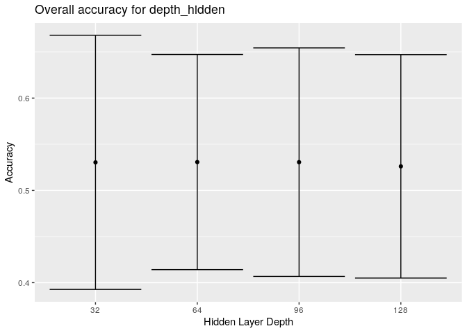
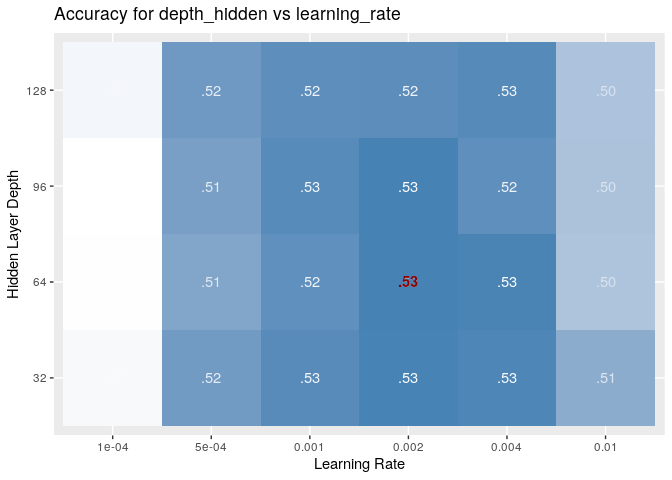
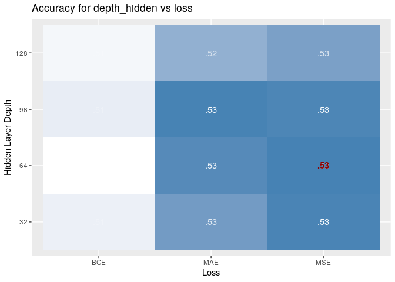
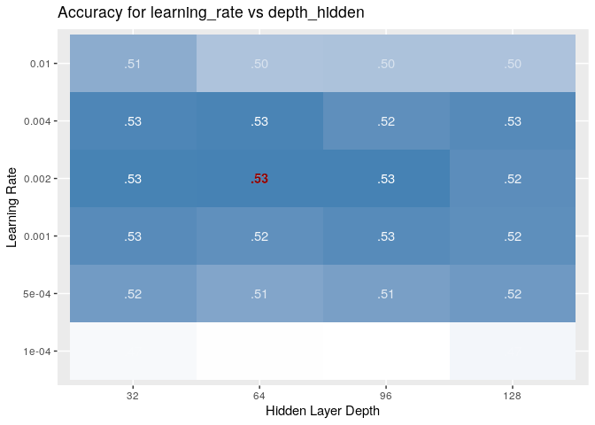
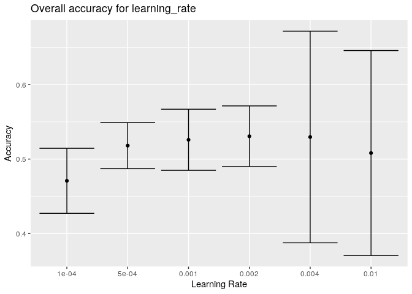
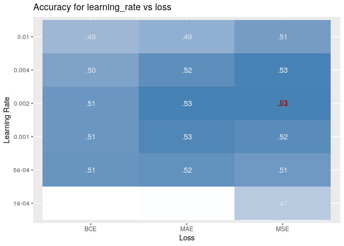
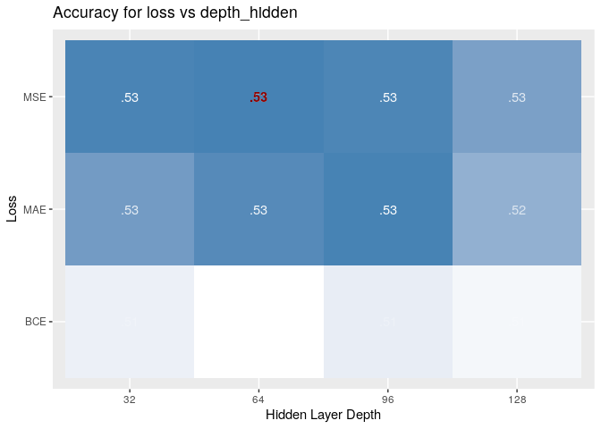
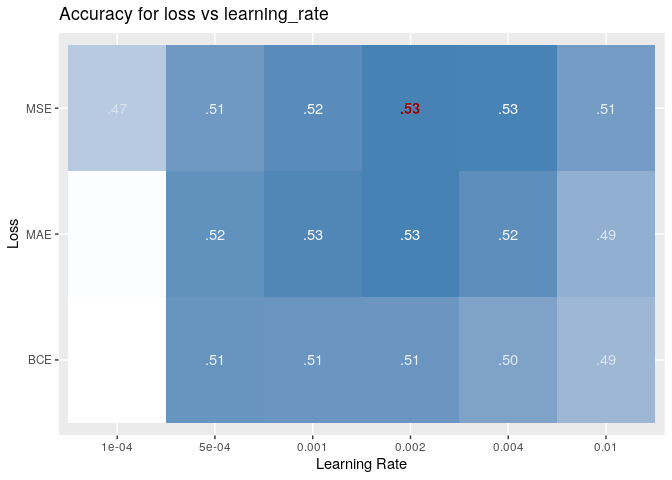
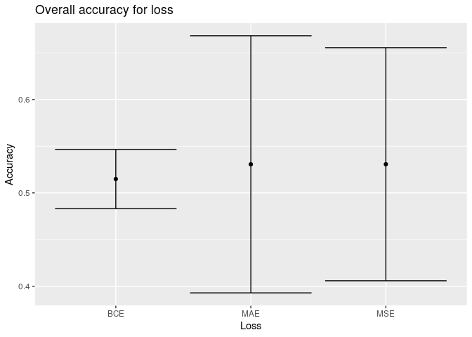

Grid search results for CNN
================

# Data

``` r
library(tidyverse)
library(gridExtra)
library(here)
library(glue)
source(here("src/lib/functions.R"))

raw = purrr::map_df(str_c(here("data/intermediate/gridsearch_"), 1:5, ".csv"), read_csv)


d = raw %>% mutate(loss=fct_recode(loss, MAE="mean_absolute_error", "BCE"="binary_crossentropy", MSE="mean_squared_error"),
                train_embedding=ifelse(train_embedding, "Y", "N")) 

d2 = d %>% group_by_at(vars(experiment:epoch)) %>% summarise_at(vars(acc:cortot), list(mean=mean, sd=sd), na.rm=T) %>% ungroup()
```

# Best parameter combination

Overall best parameters:

``` r
d2 %>% arrange(-acc_mean) %>% head()
```

    ## # A tibble: 6 x 16
    ##   experiment depth_hidden learning_rate loss  n_hidden output_dim
    ##        <dbl>        <dbl>         <dbl> <fct>    <dbl>      <dbl>
    ## 1        239           32        0.0005 BCE          0          3
    ## 2        887           96        0.0005 BCE          0          3
    ## 3        239           32        0.0005 BCE          0          3
    ## 4        563           64        0.0005 BCE          0          3
    ## 5        239           32        0.0005 BCE          0          3
    ## 6        239           32        0.0005 BCE          0          3
    ## # … with 10 more variables: train_embedding <chr>, epoch <dbl>, acc_mean <dbl>,
    ## #   cor_mean <dbl>, mse_mean <dbl>, cortot_mean <dbl>, acc_sd <dbl>,
    ## #   cor_sd <dbl>, mse_sd <dbl>, cortot_sd <dbl>

# Visualization of parameter pairs

For each parameter, the overall effect and confidence interval is given.
For all parameter pairs, a heatmap of accuracy for each combination is
given with the highest score highlighted in red.

``` r
vars = colnames(d2 %>% select(depth_hidden:epoch))
vars = vars[1:3]

labels = c(depth_hidden="Hidden Layer Depth", learning_rate="Learning Rate", loss="Loss", n_hidden="# of Hidden Layers", output_dim="Output Dimensionality", train_embedding="Retrain Embedding Layer?", epoch="# Epochs")

d2 = d2 %>% mutate(value=acc_mean, sd=acc_sd)
d2 = d2 %>% mutate(value=cor_mean, sd=cor_sd)
plots = list()
for(var1 in vars) {
  d2$target1 = as.factor(d2[[var1]])
  for (var2 in vars) {
    d2$target2 = as.factor(d2[[var2]])
    if (var1 == var2) {
      plot = 
        d2 %>% select(target1, value, sd) %>% na.omit %>% group_by(target1) %>% summarize(value=max(value), sd=sd[which.max(value)]) %>% 
        ggplot(aes(x=target1, y=value, ymin=value-sd, ymax=value+sd)) + geom_point() + geom_errorbar() +
                ylab("Accuracy") + xlab(labels[var2]) + ggtitle(glue("Overall accuracy for {var2}"))

    } else {
      
      data = d2 %>% select(target1, target2, value, sd) %>% na.omit  %>% group_by(target1, target2) %>% summarize(value=max(value)) %>% arrange(-value)
      plot=  ggplot(data=data, aes(x=target2, y=target1, fill=value, label=str_replace(format(value, digits=2), "0\\.", "."))) + geom_tile() + 
        geom_text(aes(alpha=sqrt(value)), color="white") + geom_text(data=head(data,1), color="darkred", fontface = "bold") + 
        scale_fill_gradient(low="white", high="steelblue", guide=F)+ylab(var1)+xlab(var2) + guides(alpha=FALSE) + 
        ylab(labels[var1]) + xlab(labels[var2]) +
        ggtitle(glue("Accuracy for {var1} vs {var2}"))
    }
    print(plot)
  }
}
```

<!-- --><!-- --><!-- --><!-- --><!-- --><!-- --><!-- --><!-- --><!-- -->
