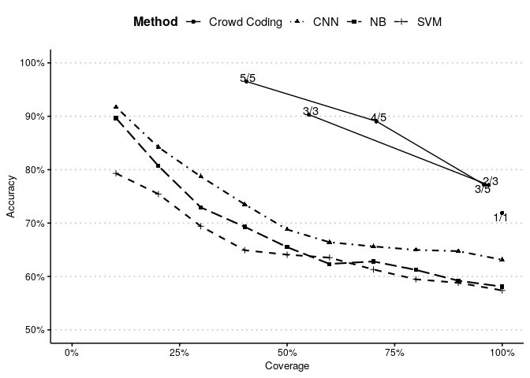
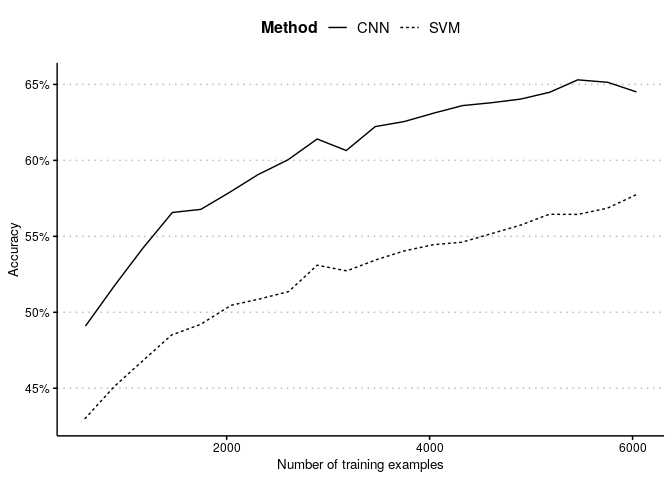
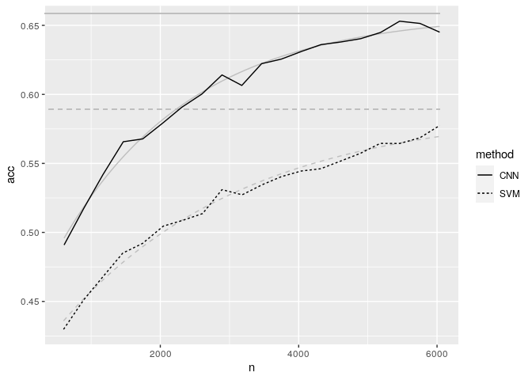

Analysis
================

## Data

``` r
library(tidyverse)
library(here)
source(here("src/lib/functions.R"))
gold = read_csv(here("data/intermediate/gold.csv")) %>% rename(gold=value)
scores = read_csv(here("data/intermediate/combined_predictions.csv"), col_types = "iccccddd")
scores = scores %>% filter(is.na(language) | language != "google", variable != "recessie", variable != "boukes")  %>% mutate(value=trichotomize(value))
names = read_csv(here("src/analysis/report_names.csv"))
sections = setNames(nm=unique(names$section))
variables = setNames(nm=unique(names$variable))
```

## Overall performance of various methods

Compute scores per method x repetition, take average score per method:

``` r
perf = inner_join(scores, gold) %>% 
  mutate(correct=gold == value)%>% 
  group_by(method, language, variable, repetition) %>% 
  summarize(acc=mean(correct), #cor=cor(gold, value), 
            alpha=alpha(gold, value), 
            pos_precision=precision(value, gold, 1), pos_recall=recall(value, gold, 1), pos_f1=f1(pos_precision, pos_recall),
            neut_precision=precision(value, gold, 0), neut_recall=recall(value, gold, 0), neut_f1=f1(neut_precision, neut_recall),
            neg_precision=precision(value, gold, -1), neg_recall=recall(value, gold, -1), neg_f1=f1(neg_precision, neg_recall)) %>%  
  summarize_at(vars(acc:last_col()), mean) %>% 
  arrange(match(method, c("dictionary", "ml", "crowd", "manual")), language, variable ) %>% 
  ungroup() %>% left_join(names) %>% select(section, name, acc:neg_f1)
table2 = knitr::kable(perf %>% mutate(section=str_remove_all(section, "\\(.*")), digits=2)
table2
```

| section              | name             |  acc | alpha | pos\_precision | pos\_recall | pos\_f1 | neut\_precision | neut\_recall | neut\_f1 | neg\_precision | neg\_recall | neg\_f1 |
| :------------------- | :--------------- | ---: | ----: | -------------: | ----------: | ------: | --------------: | -----------: | -------: | -------------: | ----------: | ------: |
| English Dictionaries | AFINN            | 0.43 |  0.27 |           0.35 |        0.38 |    0.37 |            0.40 |         0.50 |     0.45 |           0.58 |        0.38 |    0.46 |
| English Dictionaries | DamstraBoukes    | 0.42 |  0.07 |           0.67 |        0.08 |    0.15 |            0.40 |         0.98 |     0.57 |           1.00 |        0.02 |    0.04 |
| English Dictionaries | GenInq           | 0.41 |  0.26 |           0.31 |        0.37 |    0.34 |            0.38 |         0.38 |     0.38 |           0.54 |        0.47 |    0.51 |
| English Dictionaries | HuLiu            | 0.46 |  0.34 |           0.40 |        0.30 |    0.34 |            0.42 |         0.62 |     0.50 |           0.65 |        0.40 |    0.50 |
| English Dictionaries | LoughranMcDonald | 0.50 |  0.29 |           0.50 |        0.14 |    0.22 |            0.46 |         0.79 |     0.58 |           0.62 |        0.43 |    0.51 |
| English Dictionaries | LSD              | 0.46 |  0.33 |           0.39 |        0.40 |    0.39 |            0.42 |         0.54 |     0.48 |           0.62 |        0.41 |    0.50 |
| English Dictionaries | Muddiman         | 0.48 |  0.27 |           0.48 |        0.38 |    0.43 |            0.46 |         0.71 |     0.55 |           0.57 |        0.30 |    0.39 |
| English Dictionaries | NRC              | 0.42 |  0.23 |           0.34 |        0.62 |    0.44 |            0.43 |         0.32 |     0.37 |           0.57 |        0.39 |    0.46 |
| English Dictionaries | RID              | 0.42 |  0.06 |           0.00 |        0.00 |    0.00 |            0.41 |         0.97 |     0.57 |           0.82 |        0.09 |    0.16 |
| Dictionaries         | DANEW            | 0.42 |  0.10 |           0.75 |        0.08 |    0.15 |            0.40 |         0.97 |     0.57 |           0.80 |        0.04 |    0.08 |
| Dictionaries         | DamstraBoukes    | 0.41 |  0.05 |           0.83 |        0.07 |    0.13 |            0.40 |         0.99 |     0.57 |           0.00 |        0.00 |    0.00 |
| Dictionaries         | Muddiman         | 0.49 |  0.31 |           0.53 |        0.38 |    0.44 |            0.46 |         0.64 |     0.53 |           0.53 |        0.39 |    0.45 |
| Dictionaries         | NRC              | 0.47 |  0.32 |           0.39 |        0.53 |    0.45 |            0.46 |         0.44 |     0.45 |           0.59 |        0.46 |    0.52 |
| Dictionaries         | Pattern          | 0.39 |  0.07 |           0.43 |        0.08 |    0.14 |            0.39 |         0.90 |     0.54 |           0.38 |        0.03 |    0.06 |
| Dictionaries         | Polyglot         | 0.42 |  0.26 |           0.38 |        0.32 |    0.34 |            0.39 |         0.55 |     0.45 |           0.53 |        0.33 |    0.41 |
| Machine Learning     | CNN              | 0.63 |  0.50 |           0.68 |        0.49 |    0.56 |            0.58 |         0.78 |     0.66 |           0.72 |        0.57 |    0.63 |
| Machine Learning     | NB               | 0.58 |  0.39 |           0.74 |        0.34 |    0.47 |            0.52 |         0.83 |     0.64 |           0.65 |        0.47 |    0.55 |
| Machine Learning     | SVM              | 0.57 |  0.41 |           0.69 |        0.37 |    0.48 |            0.52 |         0.79 |     0.62 |           0.64 |        0.48 |    0.55 |
| Crowd-Coding         | Single Coder     | 0.72 |  0.75 |           0.69 |        0.84 |    0.76 |            0.69 |         0.58 |     0.63 |           0.78 |        0.78 |    0.78 |
| Crowd-Coding         | Vote (3 Coders)  | 0.77 |  0.81 |           0.73 |        0.89 |    0.80 |            0.74 |         0.65 |     0.69 |           0.83 |        0.81 |    0.82 |
| Crowd-Coding         | Vote (5 Coders)  | 0.77 |  0.81 |           0.73 |        0.90 |    0.81 |            0.73 |         0.65 |     0.69 |           0.84 |        0.80 |    0.82 |
| Manual Coding        | Single Coder     | 0.82 |  0.82 |           0.88 |        0.86 |    0.87 |            0.76 |         0.81 |     0.78 |           0.84 |        0.80 |    0.82 |
| Manual Coding        | Vote (3 Coders)  | 0.88 |  0.90 |           0.97 |        0.91 |    0.94 |            0.82 |         0.88 |     0.85 |           0.87 |        0.84 |    0.86 |

Make markdown table for the appendix.

``` r
fn = here("report/figures/table_performance.md")
cat("# Table 2: Overall Performance of the Tested Sentiment Analysis Approaches\n\n", file=fn)
cat(table2, file=fn, sep="\n", append=T)
```

Make the latex table for the manuscript. I’m using jinja2 template
[table.tex.j2](table.tex.j2) which is called with a json string
containing the data.

``` r
methodnames = setNames(as.list(names$name), names$variable)
table = purrr::map(sections, ~filter(perf, section == .) %>% select(name:neg_f1)) 
table$`Gold Standard` = NULL
render_j2("src/analysis/table_performance.tex.j2", "report/figures/table_performance.tex", data=list(data=table, methods=methodnames))
```

## Alternative: performance vs average student coding (from boukes et al) rather than gold standard

Alternative gold standard: voted outcome for headlines coded by 3
students plus simple value for other
headlines:

``` r
mgold3 = scores %>% filter(variable == "manual3") %>% select(id, gold=value)
mgold1 = scores %>% filter(variable == "manual1") %>% anti_join(mgold3, by="id") %>% select(id, gold=value)
mgold = bind_rows(mgold1, mgold3)
```

Compute performance against these values:

``` r
table = scores %>% filter(method == "ml") %>% inner_join(mgold) %>% 
  mutate(correct=gold == value)%>% 
  group_by(method, language, variable, repetition) %>% 
  summarize(acc=mean(correct), #cor=cor(gold, value), 
            alpha=alpha(gold, value), 
            pos_precision=precision(value, gold, 1), pos_recall=recall(value, gold, 1), pos_f1=f1(pos_precision, pos_recall),
            neut_precision=precision(value, gold, 0), neut_recall=recall(value, gold, 0), neut_f1=f1(neut_precision, neut_recall),
            neg_precision=precision(value, gold, -1), neg_recall=recall(value, gold, -1), neg_f1=f1(neg_precision, neg_recall)) %>%  
  summarize_at(vars(acc:last_col()), mean) %>% 
  arrange(match(method, c("dictionary", "ml", "crowd", "manual")), language, variable ) %>% 
  ungroup() %>% left_join(names) %>% select(section, name, acc:neg_f1)

fn = here("report/figures/table_performance_alternative.md")
cat("# Supplementary table: Performance Machine Learning validated against Student Coding\n\n", file=fn)
cat(knitr::kable(table, digits=2), file=fn, sep="\n", append=T)
```

## Bivariate correlations between dictionaries

Create a wide data frame with all methods as a column

``` r
wide_scores = scores %>% filter(method=="dictionary") %>%
  mutate(value=trichotomize(value), 
         variable = ifelse(!is.na(repetition), paste(variable, repetition, sep=":"), variable)) %>%
   select(id, variable, value) %>% bind_rows(gold %>% add_column(variable="gold") %>% rename(value=gold)) %>% 
  pivot_wider(id_cols="id", names_from = "variable", values_from = "value")
```

Compute bivariate correlations, pivot to longer, and average scores with
repetition, and pivot back to
wide

``` r
cors = cor(wide_scores %>% select(-id), use = "pairwise") %>% as_tibble(rownames = "method") %>% 
  pivot_longer(-method, names_to="method2") %>% 
  separate(method, sep=":", into=c("method", "repetition"), fill = "right") %>%
  separate(method2, sep=":", into=c("method2", "repetition2"), fill = "right") %>%
  group_by(method, method2) %>% summarize(value=mean(value)) 
# Surely there is a more R-onic way to convert a key1,key2,value data table into a nested list...?
cors_dict = purrr::map(variables, function(x1) purrr::map(variables, function(x2) cors$value[cors$method==x1 & cors$method2 == x2]))
```

Create latex table with j2 template

``` r
used_names = names %>% filter(variable %in% cors$method)
used_sections = sections[sections %in% used_names$section]
varnames = purrr::map(used_sections, ~filter(names, section == .))
render_j2("src/analysis/table_corr.tex.j2", "report/figures/table_corr.tex", data=list(data=cors_dict, names=varnames))
```

## Correlation between uncertainty and accuracy

For crowd, get number of coders and majority size, compute accuracy per
ncoder x majority, and compute cumulative accuracy and
coverage:

``` r
crowd_cov = scores  %>% inner_join(gold) %>% filter(method == "crowd") %>% 
  mutate(ncoder=as.numeric(str_remove(variable, "crowd")), 
         support=ifelse(ncoder==1, 1, confidence),
         correct=as.numeric(gold==value)) %>% 
  filter(support != 0) %>% select(id, ncoder, support, correct, repetition) %>%
  group_by(ncoder, support) %>% summarize(n=n(), ncorrect=sum(correct), nrep=replace_na(max(repetition), 1)) %>% 
  arrange(ncoder, desc(support))  %>%  
  mutate(accuracy=cumsum(ncorrect)/cumsum(n), coverage=cumsum(n)/(284*nrep), label=str_c(support, ncoder, sep="/"))
knitr::kable(crowd_cov, digits = 2)
```

| ncoder | support |    n | ncorrect | nrep | accuracy | coverage | label |
| -----: | ------: | ---: | -------: | ---: | -------: | -------: | :---- |
|      1 |       1 | 1420 |     1021 |    5 |     0.72 |     1.00 | 1/1   |
|      3 |       3 | 1565 |     1413 |   10 |     0.90 |     0.55 | 3/3   |
|      3 |       2 | 1185 |      708 |   10 |     0.77 |     0.97 | 2/3   |
|      5 |       5 |  115 |      111 |    1 |     0.97 |     0.40 | 5/5   |
|      5 |       4 |   86 |       68 |    1 |     0.89 |     0.71 | 4/5   |
|      5 |       3 |   71 |       31 |    1 |     0.77 |     0.96 | 3/5   |

For ML, bin into 10 equal confidence bins per method x repetition,
average over repetitions, and compute cumulative accuracy per bin

``` r
ml_cov = scores %>% inner_join(gold) %>% filter(method == "ml") %>% 
  mutate(repetition=replace_na(repetition, 0), correct=as.numeric(gold==value)) %>% 
  select(id, variable, repetition, confidence, correct) %>% 
  group_by(variable, repetition) %>% arrange(variable, repetition, confidence) %>% 
  mutate(bin=cut_number(seq_along(id), n=10, labels=1:10)) %>% 
  group_by(variable, bin, repetition) %>% summarize(n=n(), ncorrect=sum(correct)) %>% 
  summarize(n=mean(n), ncorrect=mean(ncorrect)) %>%
  arrange(variable, desc(bin)) %>%
  mutate(accuracy=cumsum(ncorrect) / cumsum(n), coverage=cumsum(n)/284) 
knitr::kable(ml_cov, digits=2)
```

| variable | bin |  n | ncorrect | accuracy | coverage |
| :------- | :-- | -: | -------: | -------: | -------: |
| cnn      | 10  | 29 |     26.6 |     0.92 |      0.1 |
| cnn      | 9   | 28 |     21.4 |     0.84 |      0.2 |
| cnn      | 8   | 28 |     18.9 |     0.79 |      0.3 |
| cnn      | 7   | 29 |     16.9 |     0.74 |      0.4 |
| cnn      | 6   | 28 |     13.9 |     0.69 |      0.5 |
| cnn      | 5   | 28 |     15.2 |     0.66 |      0.6 |
| cnn      | 4   | 29 |     17.7 |     0.66 |      0.7 |
| cnn      | 3   | 28 |     16.9 |     0.65 |      0.8 |
| cnn      | 2   | 28 |     17.6 |     0.65 |      0.9 |
| cnn      | 1   | 29 |     14.2 |     0.63 |      1.0 |
| nb       | 10  | 29 |     26.0 |     0.90 |      0.1 |
| nb       | 9   | 28 |     20.0 |     0.81 |      0.2 |
| nb       | 8   | 28 |     16.0 |     0.73 |      0.3 |
| nb       | 7   | 29 |     17.0 |     0.69 |      0.4 |
| nb       | 6   | 28 |     14.0 |     0.65 |      0.5 |
| nb       | 5   | 28 |     13.0 |     0.62 |      0.6 |
| nb       | 4   | 29 |     19.0 |     0.63 |      0.7 |
| nb       | 3   | 28 |     14.0 |     0.61 |      0.8 |
| nb       | 2   | 28 |     12.0 |     0.59 |      0.9 |
| nb       | 1   | 29 |     14.0 |     0.58 |      1.0 |
| svm      | 10  | 29 |     23.0 |     0.79 |      0.1 |
| svm      | 9   | 28 |     20.0 |     0.75 |      0.2 |
| svm      | 8   | 28 |     16.0 |     0.69 |      0.3 |
| svm      | 7   | 29 |     15.0 |     0.65 |      0.4 |
| svm      | 6   | 28 |     17.0 |     0.64 |      0.5 |
| svm      | 5   | 28 |     17.0 |     0.64 |      0.6 |
| svm      | 4   | 29 |     14.0 |     0.61 |      0.7 |
| svm      | 3   | 28 |     13.0 |     0.59 |      0.8 |
| svm      | 2   | 28 |     15.0 |     0.59 |      0.9 |
| svm      | 1   | 29 |     13.0 |     0.57 |      1.0 |

Combine into a single
plot:

``` r
ml_cov2 = ml_cov %>% ungroup() %>% mutate(method=toupper(variable), variable=toupper(variable)) %>% 
  select(method, variable, accuracy, coverage)
crowd_cov2 = crowd_cov %>% ungroup() %>% mutate(variable="Crowd Coding", method=paste0("Crowd (", ncoder, " Coder)")) %>%
  select(method, variable, accuracy, coverage, label)
combined = bind_rows(ml_cov2, crowd_cov2) %>% mutate(variable=fct_reorder(variable, -accuracy))


plot = ggplot(combined, aes(x=coverage, y=accuracy)) + 
  geom_line(aes(group=method, lty=variable, size=ifelse(variable=="Crowd Coding", .5, .75))) + 
  geom_point(aes(shape=variable)) + 
  geom_text(data=combined %>% filter(!label %in% c("3/5", "1/1")), aes(label=label), nudge_y=.008, nudge_x=.004) + 
  geom_text(data=combined %>% filter(label == "3/5"), aes(label=label), nudge_y=-.008, nudge_x=-.004) +
  geom_text(data=combined %>% filter(label == "1/1"), aes(label=label), nudge_y=-.008, nudge_x=-.004) +
  scale_linetype_manual(name="Method", values=c(CNN=4, SVM=2, NB=5, "Crowd Coding"=1)) +
  scale_size_identity() + scale_shape(name="Method")  + 
  xlab("Coverage") + ylab("Accuracy") + 
  scale_x_continuous(labels = scales::percent_format(accuracy = 1), limits = c(0,1))+
  scale_y_continuous(labels = scales::percent_format(accuracy = 1), limits = c(.5,1))+
  ggthemes::theme_clean() + theme(legend.position = "top", legend.background = element_blank(),
                                  plot.background  = element_blank())
plot
```

<!-- -->

Save plot to report
folder

``` r
ggsave(plot=plot, filename="report/figures/fig_coverage.pdf")
```

## Learning curve

``` r
curve = rbind(read_csv("data/intermediate/cnn_curve.csv") %>% add_column(method="CNN", .before=1),
              read_csv("data/intermediate/svm_curve.csv") %>% add_column(method="SVM", .before=1))
curve = curve %>% group_by(method, perc) %>% summarize(n=mean(n), acc=mean(acc))

plot = ggplot(curve, aes(x=n, y=acc, group=method, lty=method)) + geom_line() + 
  scale_linetype(name="Method") +
  xlab("Number of training examples") + ylab("Accuracy") + 
  scale_y_continuous(labels = scales::percent_format(accuracy = 1))+
  ggthemes::theme_clean() + theme(legend.position = "top", legend.background = element_blank(),
                                  plot.background  = element_blank())
plot
```

<!-- -->

Save plot to report folder

``` r
ggsave(plot=plot, filename="report/figures/fig_curve.pdf")
```

Add asymptotic fit (not used in
paper):

``` r
get_asympt = function(data) coef(nls(acc ~ SSasymp(n, Asym, R0, lrc), data=data))["Asym"]
asym_cnn = get_asympt(filter(curve, method=="CNN"))
asym_svm = get_asympt(filter(curve, method=="SVM"))

ggplot(curve, aes(x=n, y=acc, group=method, lty=method)) + 
  geom_segment(x=0, xend=max(curve$n), y=asym_cnn, yend=asym_cnn, color="grey") +
  geom_smooth(color="grey", lwd=.5, data=filter(curve, method=="CNN"), method='nls', formula=y~SSasymp(x, Asym, R0, lrc), se=F) + 
  geom_segment(x=0, xend=max(curve$n), y=asym_svm, yend=asym_svm, color="grey", lty=2) + 
  geom_smooth(color="grey", lwd=.5, lty=2, data=filter(curve, method=="SVM"), method='nls', formula=y~SSasymp(x, Asym, R0, lrc), se=F) + 
  geom_line() 
```

<!-- -->
