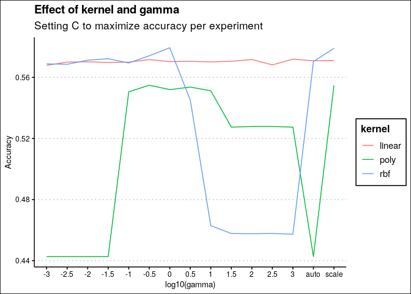
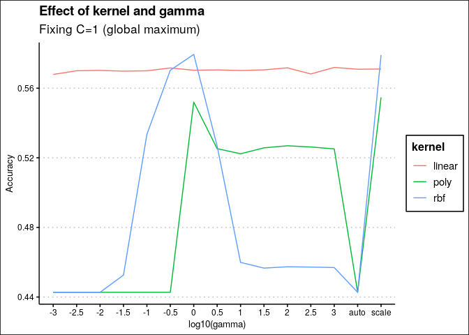
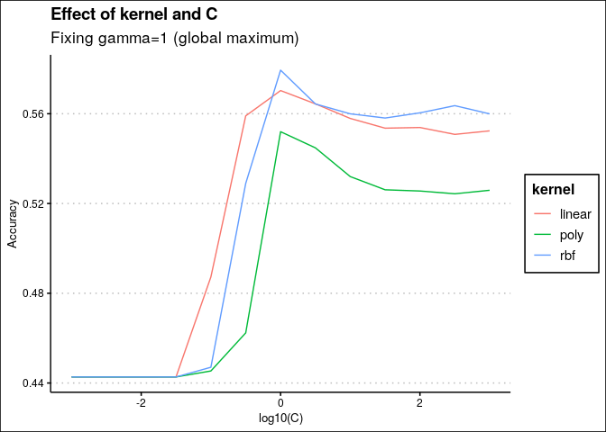

Grid search results for SVM
================

# Data

``` r
library(tidyverse)
library(here)
d = read_csv(here("data/intermediate/svm_grid.csv"))
d = d %>% group_by(experiment, kernel, C, gamma) %>% summarize(m=mean(accuracy), sd=sd(accuracy))
```

# Best model

``` r
d %>% arrange(-m)
```

    ## # A tibble: 585 x 6
    ## # Groups:   experiment, kernel, C [585]
    ##    experiment kernel     C gamma                   m     sd
    ##         <dbl> <chr>  <dbl> <chr>               <dbl>  <dbl>
    ##  1        296 rbf     1    1.0                 0.579 0.0104
    ##  2        272 rbf     1    scale               0.579 0.0108
    ##  3        338 rbf     3.16 0.31622776601683794 0.574 0.0127
    ##  4        377 rbf    10    0.03162277660168379 0.572 0.0115
    ##  5        312 linear  1    1000.0              0.572 0.0121
    ##  6        306 linear  1    100.0               0.572 0.0113
    ##  7        291 linear  1    0.31622776601683794 0.572 0.0120
    ##  8        419 rbf    31.6  0.01                0.571 0.0114
    ##  9        270 linear  1    scale               0.571 0.0131
    ## 10        273 linear  1    auto                0.571 0.0109
    ## # … with 575 more rows

# Parameters

``` r
d = d %>% mutate(gamma2=case_when(gamma %in% c("scale", "auto") ~ gamma, T~as.character(log10(as.numeric(gamma)))))

d %>% group_by(kernel, gamma) %>% arrange(-m) %>% filter(row_number() == 1) %>% 
  ggplot(aes(x=fct_reorder(gamma2, as.numeric(gamma2)), y=m, group=kernel, color=kernel)) + geom_line() +
  ggthemes::theme_clean() + xlab("log10(gamma)") + ylab("Accuracy") + ggtitle("Effect of kernel and gamma", "Setting C to maximize accuracy per experiment")
```

<!-- -->

``` r
d %>% group_by(kernel, C) %>% arrange(-m) %>% filter(row_number() == 1) %>% 
  ggplot(aes(x=log10(C), y=m, group=kernel, color=kernel)) + geom_line() +
  ggthemes::theme_clean() + xlab("log10(C)") + ylab("Accuracy") + ggtitle("Effect of kernel and C", "Setting gamma to maximize accuracy per experiment")
```

<!-- -->

``` r
d %>% filter(C==1) %>% ggplot(aes(x=fct_reorder(gamma2, as.numeric(gamma2)), y=m, group=kernel, color=kernel)) + geom_line() +
  ggthemes::theme_clean() + xlab("log10(gamma)") + ylab("Accuracy") + ggtitle("Effect of kernel and gamma", "Fixing C=1 (global maximum)")
```

<!-- -->

``` r
d %>% filter(gamma=="1.0") %>% ggplot(aes(x=log10(C), y=m, group=kernel, color=kernel)) + geom_line() +
  ggthemes::theme_clean() + xlab("log10(C)") + ylab("Accuracy") + ggtitle("Effect of kernel and C", "Fixing gamma=1 (global maximum)")
```

<!-- -->
